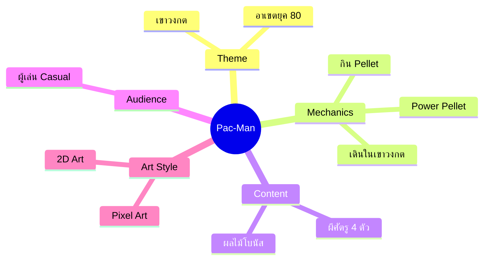
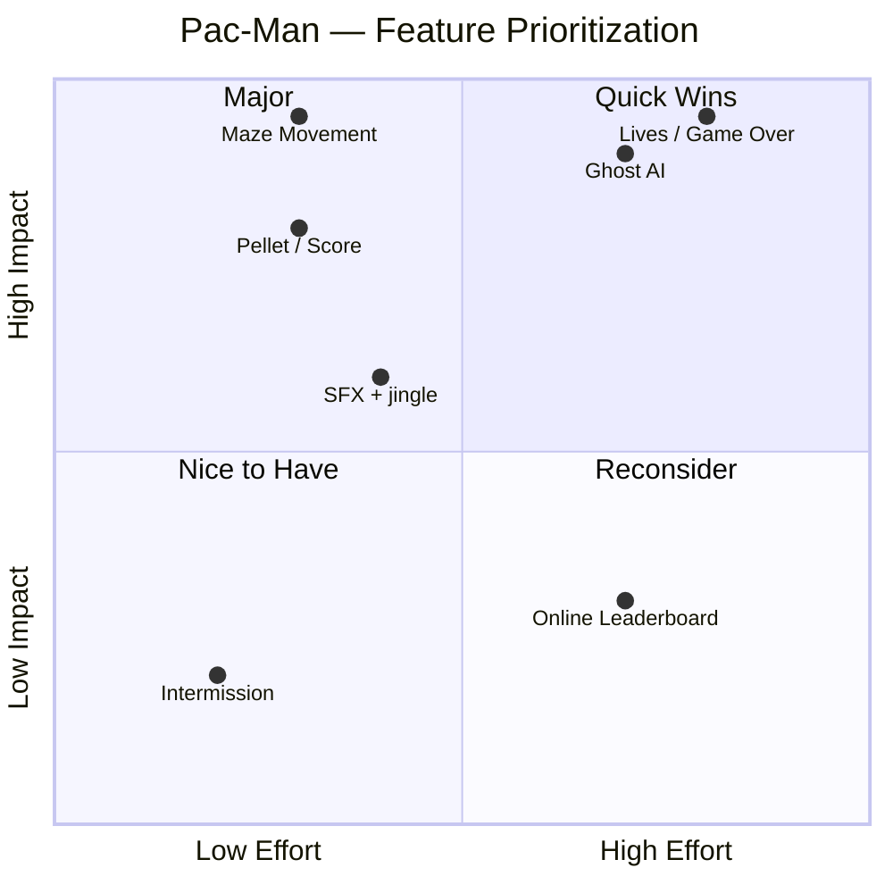
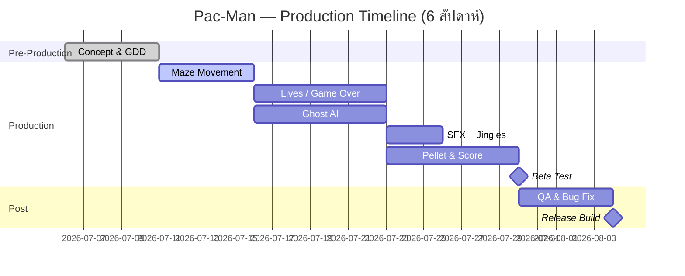

```mermaid
mindmap
 root((Pac-Man))
  Theme
   เขาวงกต
   อาเขตยุค 80
  Mechanics
   เดินในเขาวงกต
   กิน Pellet
   Power Pellet
  Content
   ผีศัตรู 4 ตัว
   ผลไม้โบนัส
  Audience
   ผู้เล่น Casual
  Art Style
    Pixel Art
    2D Art
```

```mermaid
quadrantChart
    title Pac-Man — Feature Prioritization
    x-axis Low Effort --> High Effort
    y-axis Low Impact --> High Impact
    quadrant-1 Quick Wins
    quadrant-2 Major
    quadrant-3 Nice to Have
    quadrant-4 Reconsider
    Maze Movement: [0.3, 0.95]
    Ghost AI: [0.7, 0.9]
    Online Leaderboard: [0.7, 0.3]
    Pellet / Score : [0.3,0.8]
    SFX + jingle : [0.4,0.6]
    Lives / Game Over : [0.8,0.95]
    Intermission : [0.2,0.2]
```

**// Pellet/Score, SFX, Lives / Game Over ควรอยู่ด้านบนเพราะมีความสำคัญทำให้เกมสมบูรณ์ ส่วน Intermission ในเกม Pac Man ไม่จำเป็นก็ได้**

```mermaid
gantt
title Pac-Man — Production Timeline (6 สัปดาห์)
dateFormat YYYY-MM-DD
section Pre-Production
Concept & GDD :done, c1, 2026-07-06, 5d
section Production
Maze Movement :active, p1, after c1, 5d
Lives / Game Over : p2, after p1, 7d
Ghost AI : p2, after p1, 7d
SFX + Jingles : p3, after p2, 3d
Pellet & Score : p3, after p2, 7d
Beta Test :milestone, m1, after p3, 0d
section Post
QA & Bug Fix : q1, after m1, 5d
Release Build :milestone, m2, after q1, 0d
```
